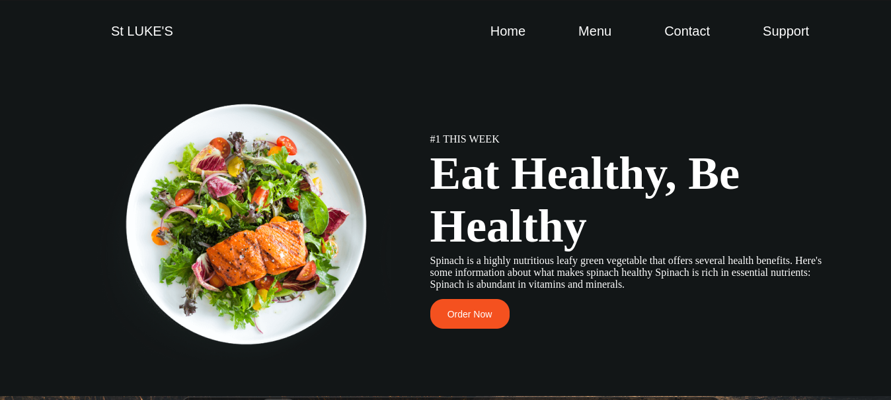

# RESTAURANT PAGE

### Short descripton 💬👨‍🏫

This is a website built using a tool called webpack. Webpack is a mordern bundling tool that aids moduler JS programming. The whole website was built using Vanilla Javascript.The website is a basic restaurant page with different foods and information.

### Demo  🏃‍♂️

link is [Here](https://mtendekuyokwa19.github.io/RestaurantPage/).

### Cloning And Viewing 🎲
1. First clone the site using:

``git@github.com:Mtendekuyokwa19/RestaurantPage.git``

2. Run the npm code:

i. ``npx webpack``

  ii.``npm run build``

iii``npm start``

### Tools and Technologies⚒️
1. Webpack
2. Vanilla Js and Es6 modules
3. Css
4. npm
5. Figma
6. Git, Github pages and Github
7. Html

### What I learned🤓
1. Webpack
2. Webpack Commands
3. npm 
4. Es6
5. Dom manipulation

### Motivation🧠
1. To practice using Webpack and npm
2. Learn how to use Es6 modules

### Credits🤓
1. [google fonts](https://fonts.google.com/specimen/Quicksand)

### Future Updates🔮
1. addition of a support page
2. addition of adding to cart
3. ease in animation 

